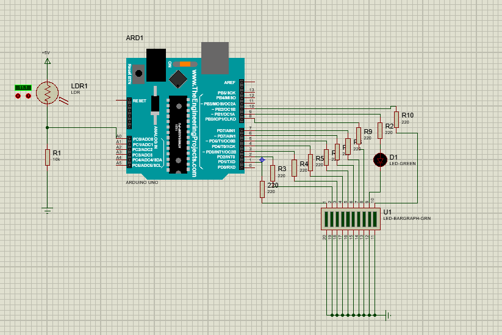

# Arduino LDR Işık Seviyesi Göstergesi

Bu proje LDR sensörü kullanarak ortam ışık seviyesini ölçer ve LED bar graf üzerinde gösterir.

## Kullanılanlar
- Arduino UNO
- LDR sensörü
- LED bar graph
- Proteus simülasyonu
- 
## Devre Görüntüsü

